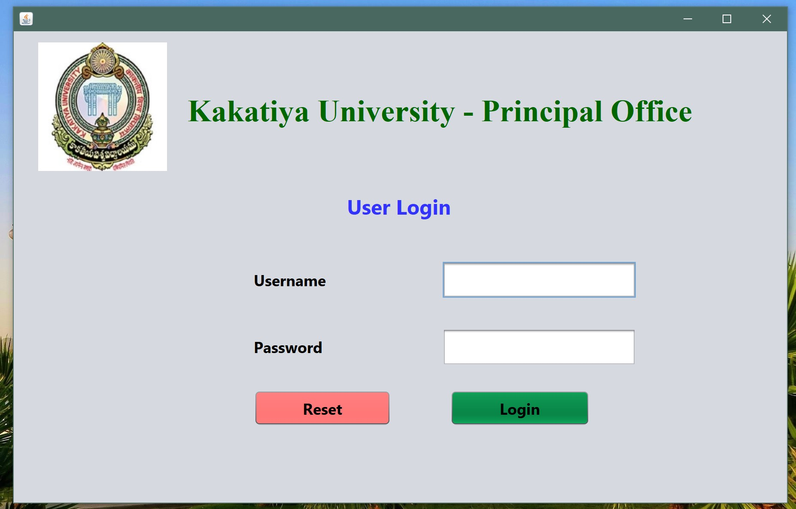
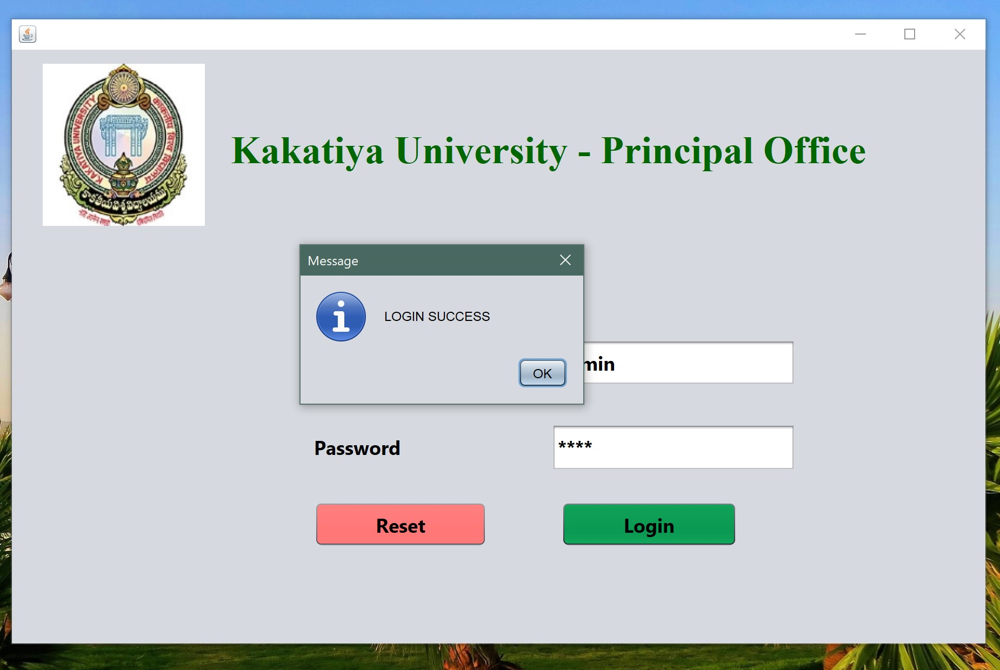
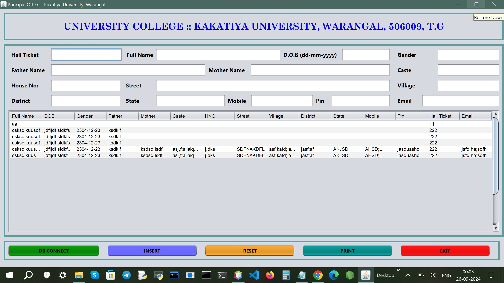
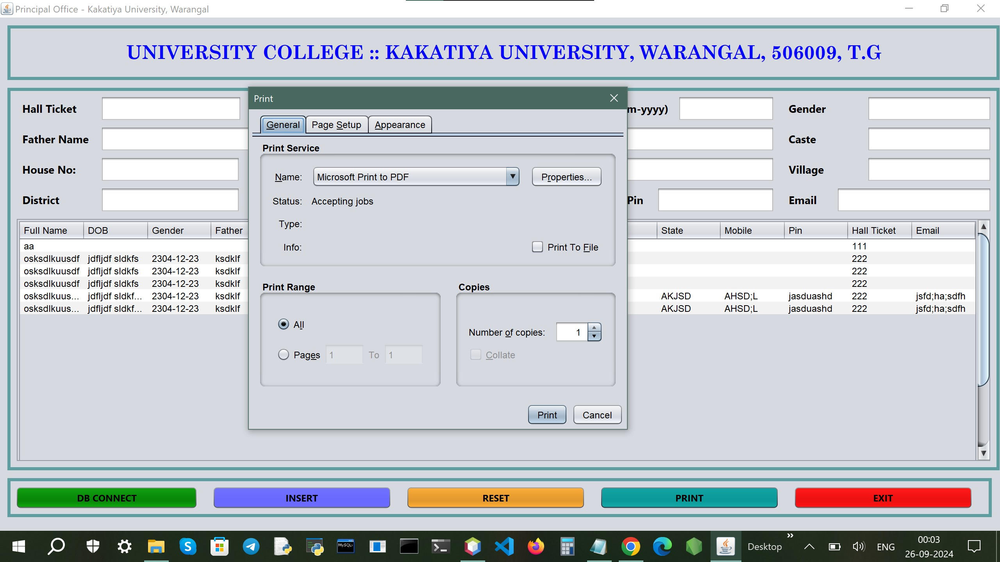

# College/University/Institute Student Management System

## Overview

The College/University/Institute Student Management System is a Java Swing-based application designed for educational institutions to manage student records efficiently. This application allows users to insert, print, and connect to an MS Access database, providing a streamlined interface for administrative tasks.

## Features

- **User Login Interface:** Secure access to the application with a login screen.
- **Insert Student Records:** Add new student information such as name, roll number, course, and contact details.
- **Print Reports:** Generate and print student records for administrative use.
- **Database Connection:** Seamless integration with an MS Access database for reliable data management.
- **Reset Functionality:** Clear input fields to facilitate new record entry.

## Technology Stack

- **Programming Language:** Java
- **Framework:** Swing
- **IDE:** NetBeans
- **Database:** MS Access

## Installation

1. **Clone the Repository:**
 
## Open the Project:

- Open NetBeans IDE and select "Open Project."
Navigate to the cloned repository and open the project.

## Set Up Database:

- Ensure you have MS Access installed.
- Configure the database connection in the application settings to point to your MS Access database file.

Run the Application:

- In NetBeans, right-click the project and select "Run" to start the application.

## Usage

- Launch the application.
- Enter your credentials on the login screen.
- Access the main functionalities:
- Use the Insert feature to add student records.
- Utilize the Print feature to generate reports.
- Use DBConnect to manage the database connection.
- Click Reset to clear input fields.

## Acknowledgments
- Thanks to the open-source community for their valuable resources and libraries.
- Special thanks to educational institutions for providing the requirements and feedback for this project.

## Screenshots

## Contributing
- Contributions are welcome! If you have suggestions for improvements or features, feel free to open an issue or submit a pull request.

##  License
- This project is licensed under the MIT License for details.

## Connect with Me

- [LinkedIn Profile](https://www.linkedin.com/in/aazam-shareef-234170171/)
